<link rel="stylesheet" href="md/readme.css">

$${\color{red}Red}$$
#{\color{red}Red}#

# $${\color{blue}Mediscreen}$$ #
# <b>Mediscreen</b> #
- Mediscreen est une société internationale qui travaille avec les cliniques de santé et les
cabinets privés pour dépister les risques de maladies.

- Une demande a été faite de fonctionnalités de gestion: 

- des données administratives du patient 	
- des données médicales du patient	
- d'estimation du risque.

- Les différents modules doivent s'intégrer dans une architecture micro-services.

# <b>Les différents applications</b> #

 
 - microservice-<r>configserver</r>  : le serveur de configuration Cloud Config
 
 
 - microservice-<r>eurekaserver</r>  : le serveur de discovery Eureka
 
 
 - microservice-<r>oauth2server</r>  : le serveur d'autorisation Oauth2
 
 
 - microservice-<r>gateway</r>       : la passerelle Spring Cloud Gateway
 
 

 - microservice-<r>patient</r>       : le micro-service de gestion des données administratives du patient
 
 
 
 - microservice-<r>patienthistory</r>       : le micro-service de gestion des données médicales du patient
 
 
 
  - microservice-<r>expert</r>       : le micro-service d' estimation du risque
  
  
  
  - microservice-<r>clientui</r>       : l'application cliente IHM
  
  
<g>Remarque</g> : Le serveur de configuration doit être lancé en premier, puis le serveur de discovery, puis le serveur d'autorisation
  Oauth2, puis les autres applications.

 
  

<b>Uniquement pour les tests</b>
  
  
  - microservice-<r>tokenutility</r>       :  mini-client oauth2 permettant de récupérer un vrai token JWT avec un script Selenium.
 

 	

# <b>Pré-requis</b> #

Le développement de l'application a été fait en environnement <r>Windows</r>, avec l'IDE <r>Eclipse</r> (installer la dernière version).

Les différentes applications sont des projets Spring Boot / Maven / Git

Spring Boot : 3.1.0    (Spring Security 6.1.0)

<b>Ce que vous devez installer sur votre machine pour le développement et les tests:</b>

- Java 20
- Maven 3.6.2
- MongoDB   (service Windows Mongo DB Server)
- MySQL 8.0.31   (service Windows MySQL80)
- Docker 

<b>Outils conseillés</b>

- Docker Desktop For Windows 4.16.3
- Mongo DB Compass 1.36.2
- MySQLWorkbench 8.0 

# <b>Batchs</b>

<b>Batch Docker</b>

- Ce batch permet de créer le container Docker.

- Dans le fichier hosts de Windows, la ligne suivante doit être créée:

		127.0.0.1 microservice-oauth2server

- Pour créer le container Docker, lancer le batch <r>docker-compose-microservices.bat</r>

- Avant de lancer ce batch, il est fortement conseillé de faire le ménage dans Docker 
(suppression des volumes, images, et containers liés au projet)

- En cas de problème, penser à supprimer le fichier <r>.docker</r> dans le répertoire utilisateur.

- Il est possible de gérer la mémoire Docker, avec le fichier <r>.wslconfig</r>, dans le répertoire utilisateur.

		memory=5GB 

<b>Batch maven package général</b>

- Le batch <r>mvn-package-all.bat</r> lance un mvn package pour tous les modules de l'application, y compris pour l'application
cliente (en lançant les applications nécessaires)

- En cas de problème, on sort en exit 1, si tout est ok, en exit 0

<b>Batch Zipkin</b>

En développement, le module Zipkin n'est pas lancé par les applications, on peut soit le lancer dans Docker (avec le <r>batch docker-zipkin-run.bat</r>) - baisser la mémoire allouée  Docker à 1 GB - , 
soit désactiver Zipkin en lançant les applications avec le profil <r>test</r> (les bases de tests seront alors utilisées également).

# <b>Présentation détaillée</b>
Pour plus d'informations, ci-dessous une présentation détaillée du projet: 

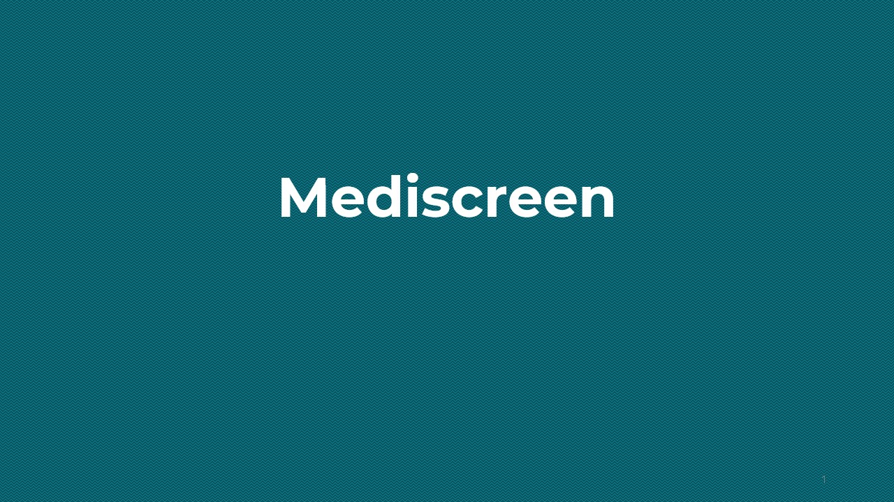
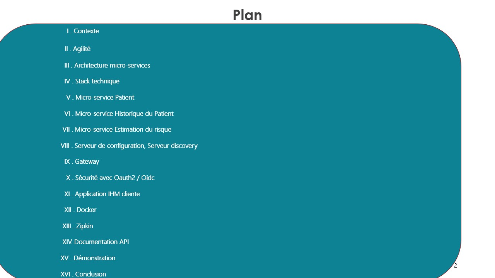
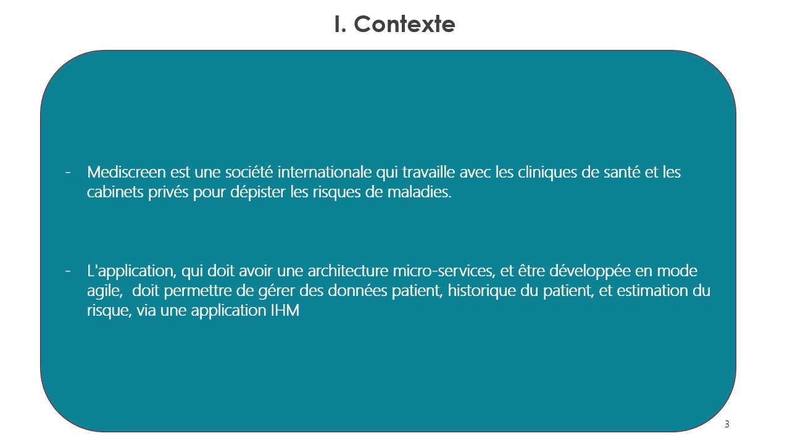
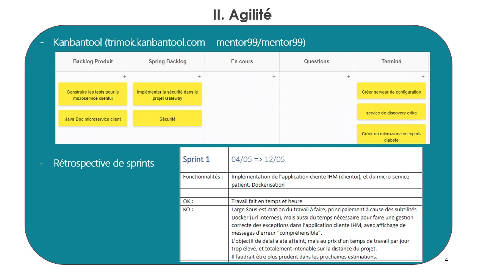
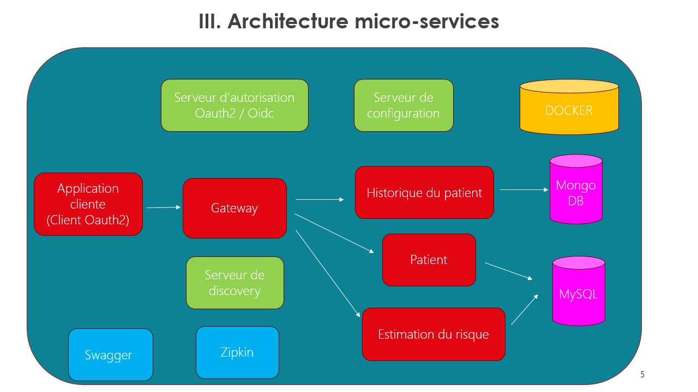
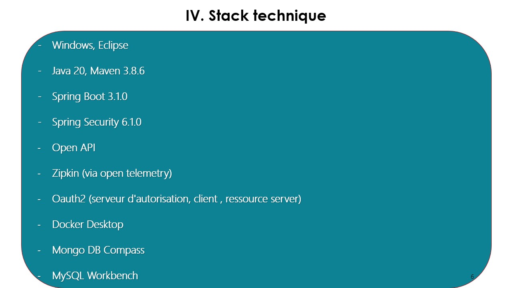
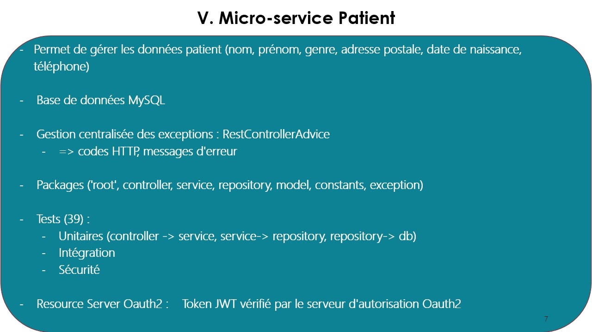
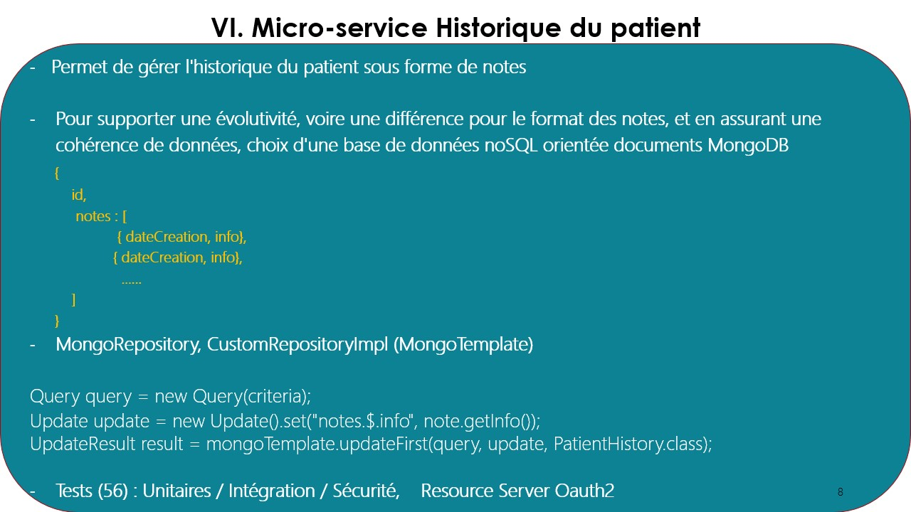
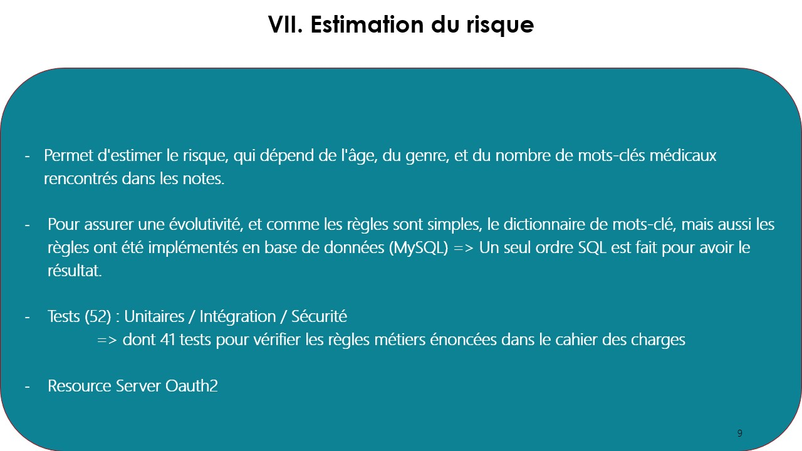
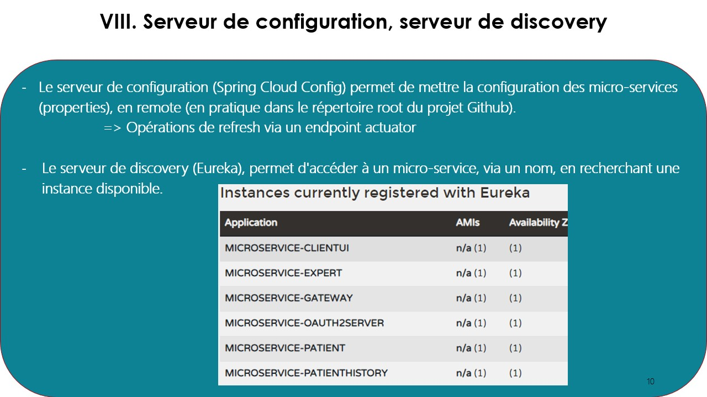
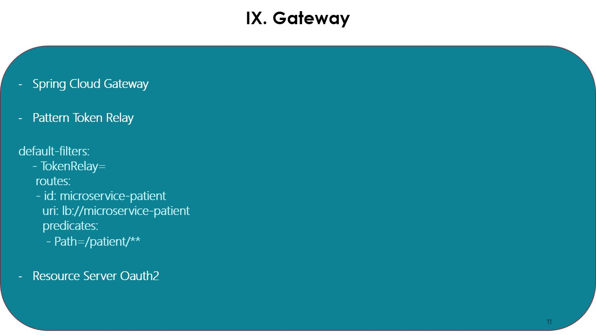
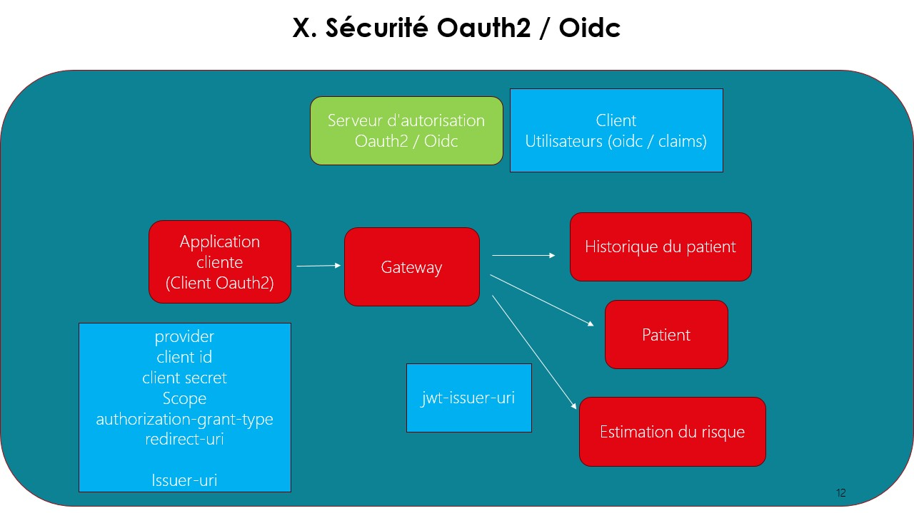
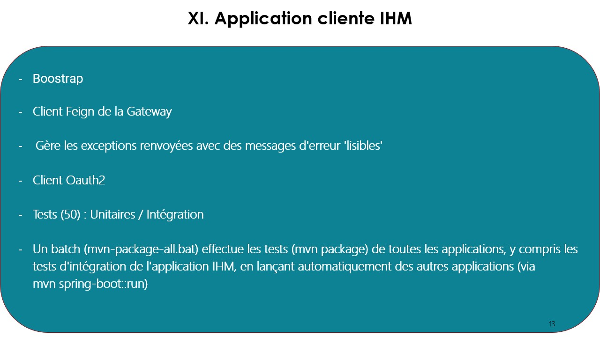
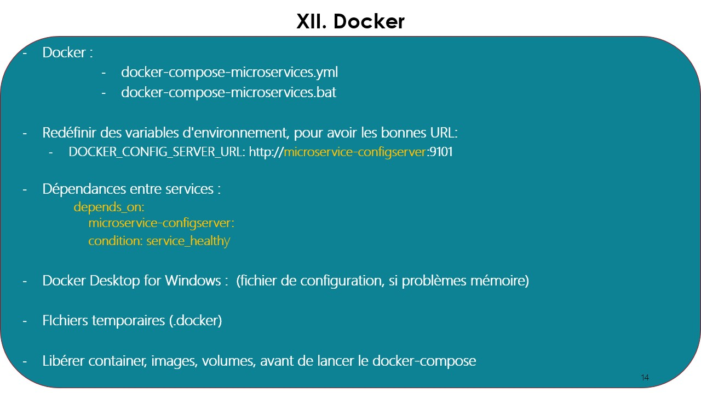
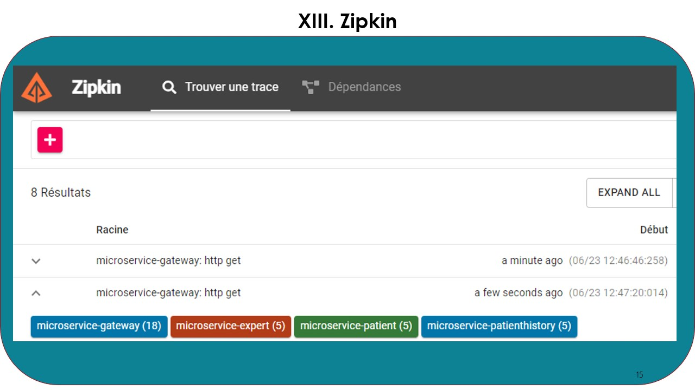
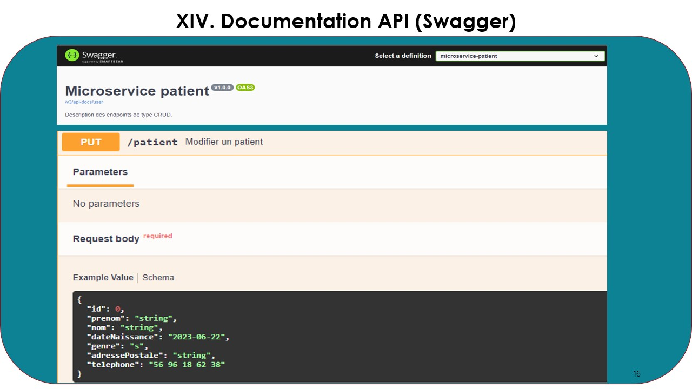
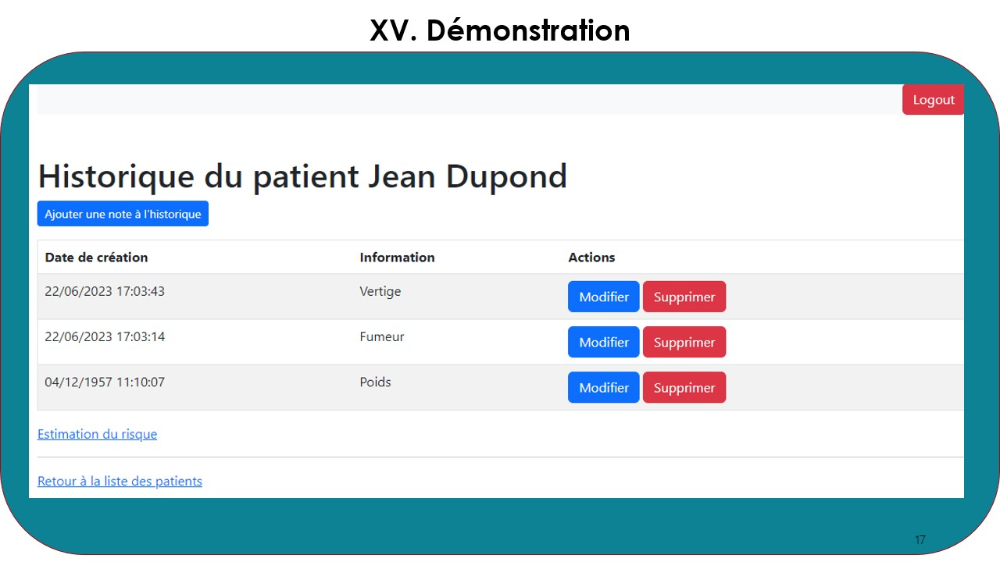
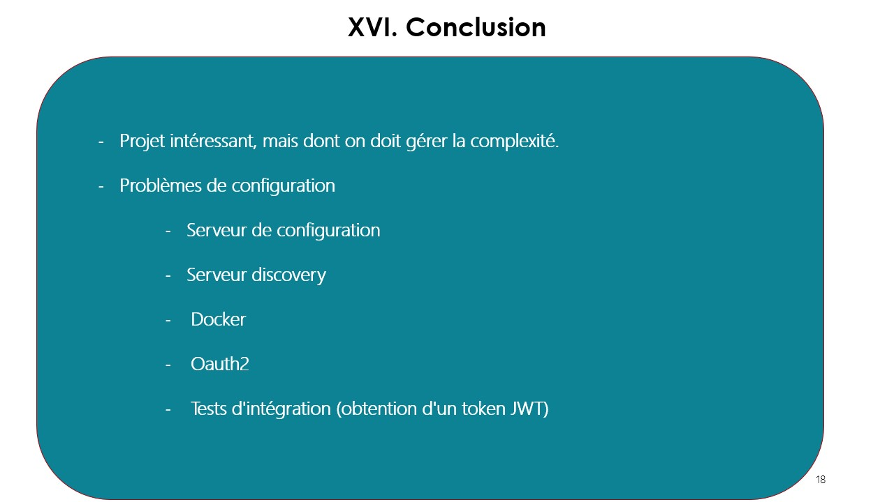

