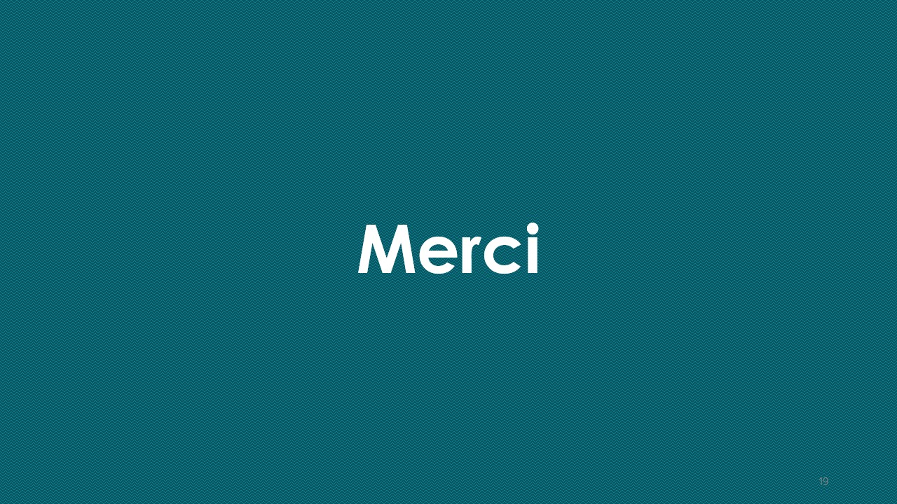

# Mediscreen 
- Mediscreen est une société internationale qui travaille avec les cliniques de santé et les
cabinets privés pour dépister les risques de maladies.

- Une demande a été faite de fonctionnalités de gestion: 

- des données administratives du patient 	
- des données médicales du patient	
- d'estimation du risque.

- Les différents modules doivent s'intégrer dans une architecture micro-services.

# Les différents applications 

 
 - microservice-**configserver**  : le serveur de configuration Cloud Config
 
 
 - microservice-**eurekaserver**  : le serveur de discovery Eureka
 
 
 - microservice-**oauth2server**  : le serveur d'autorisation Oauth2
 
 
 - microservice-**gateway**       : la passerelle Spring Cloud Gateway
 
 

 - microservice-**patient**      : le micro-service de gestion des données administratives du patient
 
 
 
 - microservice-**patienthistory**      : le micro-service de gestion des données médicales du patient
 
 
 
  - microservice-**expert**       : le micro-service d' estimation du risque
  
  
  
  - microservice-**clientui**       : l'application cliente IHM
  
  
**Remarque** : Le serveur de configuration doit être lancé en premier, puis le serveur de discovery, puis le serveur d'autorisation
  Oauth2, puis les autres applications.

 
  

Uniquement pour les tests
  
  
  - microservice-**tokenutility**       :  mini-client oauth2 permettant de récupérer un vrai token JWT avec un script Selenium.
 

 	

# Pré-requis #

Le développement de l'application a été fait en environnement Windows, avec l'IDE Eclipse (installer la dernière version).

Les différentes applications sont des projets Spring Boot / Maven / Git

Spring Boot : 3.1.0    (Spring Security 6.1.0)

**Ce que vous devez installer sur votre machine pour le développement et les tests:**

- Java 20
- Maven 3.6.2
- MongoDB   (service Windows Mongo DB Server)
- MySQL 8.0.31   (service Windows MySQL80)
- Docker 

**Outils conseillés**

- Docker Desktop For Windows 4.16.3
- Mongo DB Compass 1.36.2
- MySQLWorkbench 8.0 

# Batchs

**Batch Docker**

- Ce batch permet de créer le container Docker.

- Dans le fichier hosts de Windows, la ligne suivante doit être créée:

		127.0.0.1 microservice-oauth2server

- Pour créer le container Docker, lancer le batch **docker-compose-microservices.bat**

- Avant de lancer ce batch, il est fortement conseillé de faire le ménage dans Docker 
(suppression des volumes, images, et containers liés au projet)

- En cas de problème, penser à supprimer le fichier **.docker** dans le répertoire utilisateur.

- Il est possible de gérer la mémoire Docker, avec le fichier **.wslconfig**, dans le répertoire utilisateur.

		memory=5GB 

**Batch maven package général**

- Le batch **mvn-package-all.bat** lance un mvn package pour tous les modules de l'application, y compris pour l'application
cliente (en lançant les applications nécessaires)

- En cas de problème, on sort en exit 1, si tout est ok, en exit 0

**Batch Zipkin**

En développement, le module Zipkin n'est pas lancé par les applications, on peut soit le lancer dans Docker (avec le batch **docker-zipkin-run.bat**) - baisser la mémoire allouée  Docker à 1 GB - , 
soit désactiver Zipkin en lançant les applications avec le profil test (les bases de tests seront alors utilisées également).

# Présentation détaillée
Pour plus d'informations, ci-dessous une présentation détaillée du projet: 

